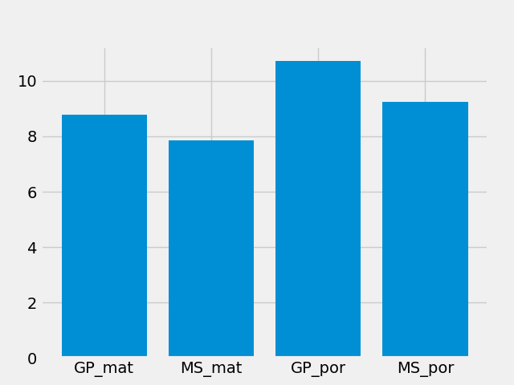

# Student-Marks-Prediction
Linear Regression model to predict the marks of students obtained in Mathematics and Portuguese given different feature sets.
# Dataset
https://archive.ics.uci.edu/ml/datasets/Student+Performance 

The below graph shows the average score of the students in Mathematics and Portuguese in two schools namely GP and MS.

